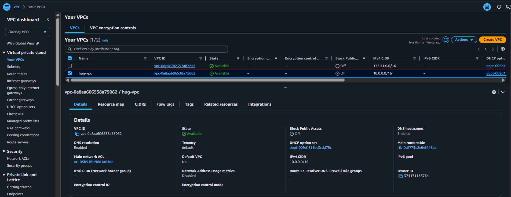

# HUG Lagos/Ibadan Terraform Challenge — Week Three

A modular Terraform project that provisions a secure, two-tier application on AWS.

The public tier runs an Nginx web server on an EC2 instance in a public subnet, while the private tier hosts an RDS database instance in private subnets with no public accessibility. Terraform state is stored remotely in S3 with DynamoDB locking.

## Architecture

- **VPC** (`10.0.0.0/16`) with DNS support and hostnames enabled
- **Public Subnets** (`10.0.1.0/24`, `10.0.2.0/24`) across two availability zones
- **Private Subnets** (`10.0.3.0/24`, `10.0.4.0/24`) across two availability zones
- **Internet Gateway** for public subnet internet access
- **NAT Gateway** for private subnet outbound internet access
- **Public Route Table** routing `0.0.0.0/0` to the Internet Gateway
- **Private Route Table** routing `0.0.0.0/0` to the NAT Gateway
- **Web Security Group** allowing:
  - SSH (`22`) from a configurable trusted CIDR (your IP)
  - HTTP (`80`) from anywhere
  - All outbound traffic
- **Database Security Group** allowing database traffic only from the web security group
- **EC2 Instance** (Ubuntu 22.04 LTS, `t2.micro`) in a public subnet, bootstrapped with `user_data` to install Nginx and serve a simple HTML page
- **RDS Instance** (MySQL 8.0, `db.t3.micro`, 20 GB) in private subnets with `publicly_accessible = false`
- **Remote state backend** (`backend/`): S3 bucket for state storage and DynamoDB table for state locking

## Modules

| Module | Path | Responsibility |
|---|---|---|
| `networking` | `modules/networking/` | VPC, public/private subnets, IGW, NAT GW, route tables and associations |
| `security_group` | `modules/security_group/` | Web and database security groups |
| `compute` | `modules/compute/` | AMI lookup, EC2 instance, user-data bootstrap and outputs |
| `database` | `modules/database/` | DB subnet group and RDS instance |

## Prerequisites

- [Terraform](https://developer.hashicorp.com/terraform/install) `>= 1.5.0`
- AWS credentials configured locally (e.g., via `aws configure` or environment variables)
- A local SSH public key file (optional, only needed if you want SSH access)

## Remote Backend Setup

The root project expects the S3 backend resources to exist before it can plan or apply.

1. **Choose a globally unique bucket name.** Edit `backend/terraform.tfvars` and replace `YOUR-AWS-ACCOUNT-ID` with your AWS account ID.

2. **Deploy the backend resources:**

   ```bash
   cd backend
   terraform init
   terraform plan
   terraform apply
   ```

3. **Create the root backend configuration.** Copy `backend.hcl.example` to `backend.hcl` and update the bucket name to match the bucket created above:

   ```bash
   cp backend.hcl.example backend.hcl
   ```

4. **Initialize the root project with the remote backend:**

   ```bash
   cd ..
   terraform init -backend-config=backend.hcl
   ```

   > If the S3 bucket name is already taken, change it in both `backend/terraform.tfvars` and `backend.hcl` before applying.

## Quick Start

1. **Configure your deployment:**

   ```bash
   cp terraform.tfvars.example terraform.tfvars
   ```

   Edit `terraform.tfvars` and replace:
   - `user_full_name` with your name
   - `allowed_ssh_cidr` with your public IP address (`x.x.x.x/32`)
   - `db_password` with a strong password

2. **Format and validate:**

   ```bash
   terraform fmt -recursive
   terraform validate
   ```

3. **Review the execution plan:**

   ```bash
   terraform plan
   ```

4. **Apply the infrastructure:**

   ```bash
   terraform apply
   ```

5. **Access the web page:**

   After `apply` completes, open the URL shown in the `website_url` output:

   ```bash
   terraform output website_url
   ```

## Useful Commands

| Command | Purpose |
|---|---|
| `terraform fmt -recursive` | Format all Terraform files |
| `terraform validate` | Validate the configuration |
| `terraform plan` | Preview changes before applying |
| `terraform apply` | Create or update infrastructure |
| `terraform output` | Show output values (IPs, URLs, IDs) |
| `terraform destroy` | Tear down all provisioned resources |

## Outputs

- `vpc_id` — ID of the created VPC
- `public_subnet_ids` — IDs of the public subnets
- `private_subnet_ids` — IDs of the private subnets
- `web_security_group_id` — ID of the web server security group
- `db_security_group_id` — ID of the database security group
- `instance_id` — ID of the EC2 instance
- `instance_public_ip` — Public IP of the web server
- `website_url` — Direct link to the Nginx landing page
- `db_instance_id` — ID of the RDS database instance
- `db_instance_endpoint` — Connection endpoint of the RDS database instance
- `db_instance_address` — Address of the RDS database instance
- `db_instance_port` — Port of the RDS database instance

## Deliverables

- Modular Terraform code in `modules/`
- Remote backend configured in `backend/`
- Deployment instructions in this README
- Screenshot of the VPC in the AWS console (`screenshots/vpc.png`)



- Screenshot of the AWS EC2 console showing the running instance (`screenshots/aws_console.png`)
- Screenshot of the AWS RDS console showing the running database instance (`screenshots/rds_console.png`)
- Screenshot of the Nginx landing page (`screenshots/webpage.png`)
- LinkedIn post explaining the implementation (`linkedin-post.md`)

## Cleanup

To avoid ongoing AWS charges, destroy the infrastructure when done:

```bash
terraform destroy
```

Then also destroy the backend resources if they are no longer needed:

```bash
terraform -chdir=backend destroy
```

## Notes

- The EC2 instance uses `t2.micro`, which is AWS Free Tier eligible.
- The RDS instance uses `db.t3.micro` with 20 GB of storage, which may incur charges; check the AWS Free Tier limits.
- `terraform.tfvars` is ignored by Git to avoid committing sensitive values such as the database password and backend bucket name.
- SSH (`22`) should be restricted to your IP address using `allowed_ssh_cidr`. Opening it to `0.0.0.0/0` is not recommended outside a learning environment.
- The database is not publicly accessible and only accepts connections from the web server security group.
